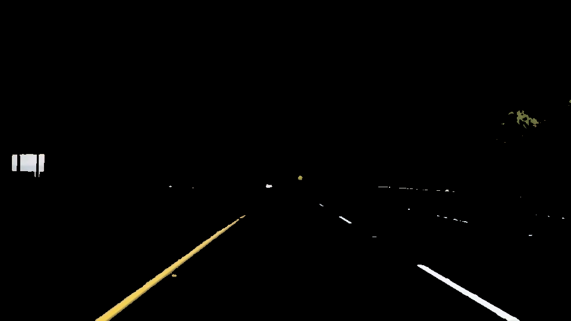
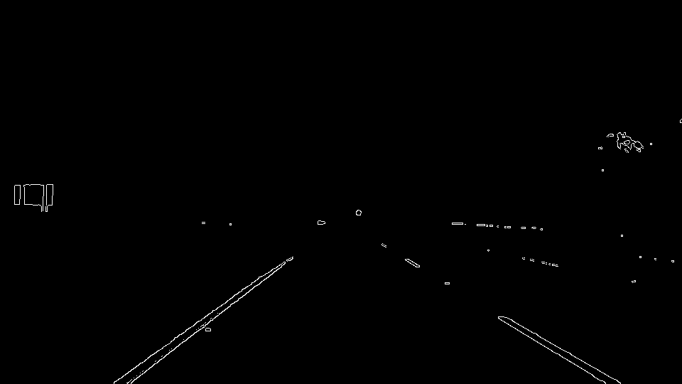
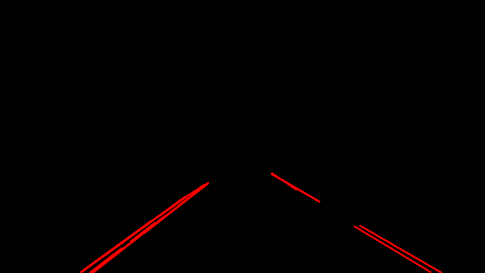
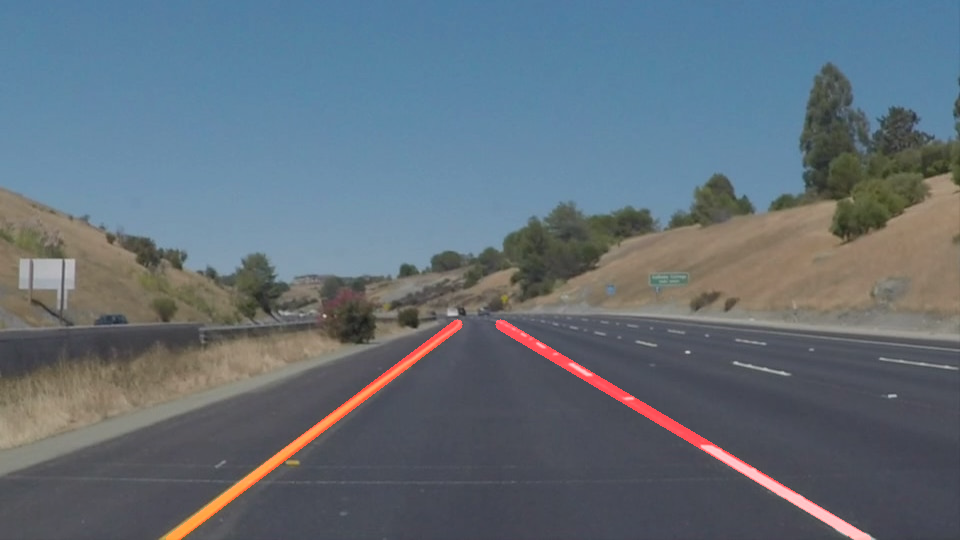

#**Finding Lane Lines on the Road** 

Project to detect lane lines in images and videos of the road in front of a car.

Full description of problem and task: [TASK.md](TASK.md)  
Source code: [P1.ipynb](P1.ipynb)  
Writeup: [WRITEUP.md](WRITEUP.md)  
Videos: [videos_lanes/](videos_lanes/)  

## Summary of lane detection pipeline

Filter white/yellow pixels -> Canny edge detection -> Hough transform to get lines -> Extrapolate to solid lane lines  

Demo gif showing the lane detection on the challenge video:  

