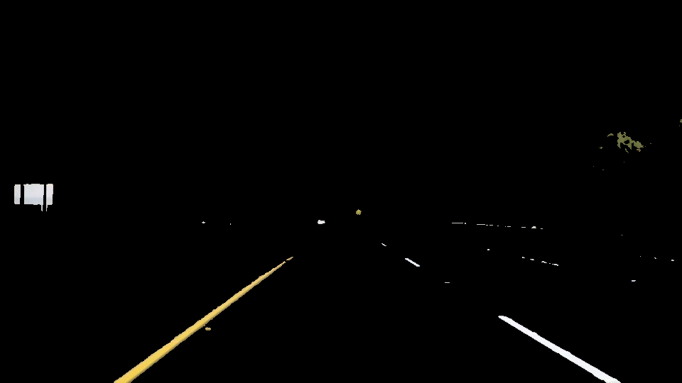
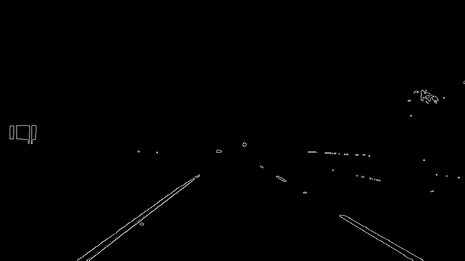
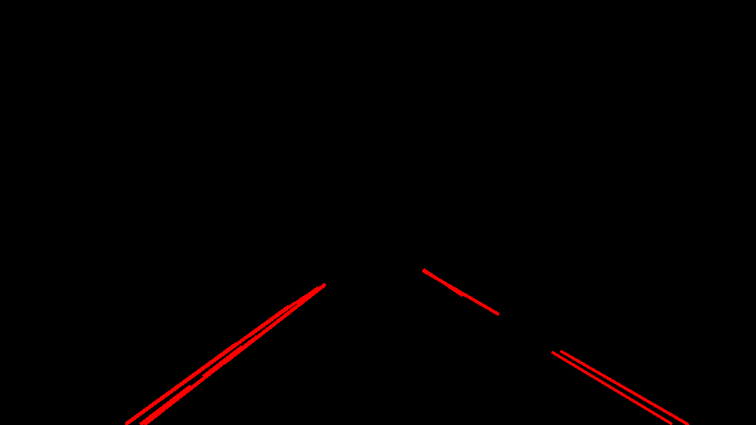
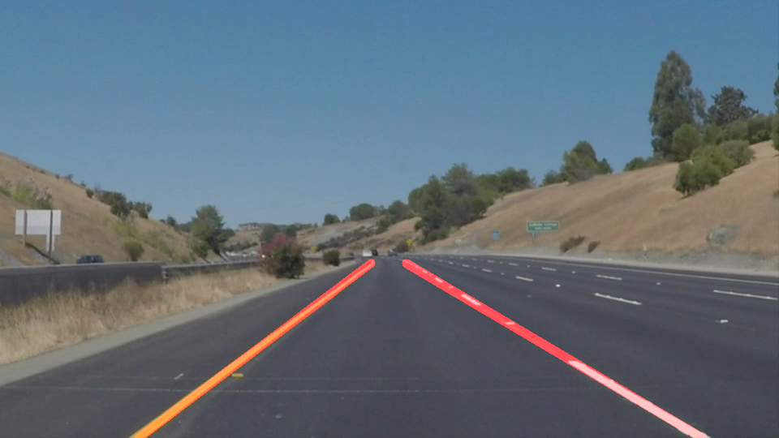
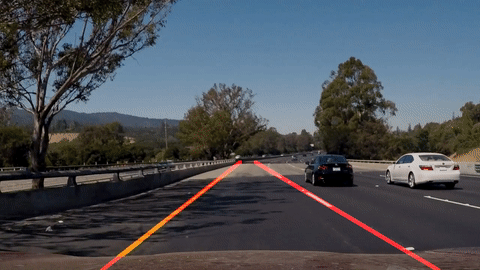

# **Finding Lane Lines on the Road** 

The goals / steps of this project are the following:
* Make a pipeline that finds lane lines on the road
* Reflect on your work in a written report

## Reflection

### 1. Pipeline

My lane detection pipeline consists of the following steps:  

1. Gaussian blur
2. White yellow filter  
3. Grayscaling
3. Canny edge detection
5. Masking the region of interest
6. Hough transform
7. Drawing lines

The functions for Gaussian blur, grayscaling, Canny edge detection, region mask
and Hough transform were taken from the template.

The **white yellow filter** was implemented mainly to solve the challenge
video. It filters the image by colors in order to keep only white and yellow
pixels because these are the only lane colors. White pixels are filtered by
keeping only pixels where the all of the RGB values are above a certain
threshold (190 in this case). Yellow pixels are filtered by transforming the
image from RGB into HSV encoding and keeping only pixels of hue between 40° and
80°. After doing this color filtering, it is significantly easier to solve to
detect lanes on the challenge video.

In order to **draw solid lines** for the left and right lanes I implemented the following:  
All hough lines are first separated by their slope where horizontal lines having an absolute slope smaller than 0.4 are discarded. 

* Positive slope lines are considered to be part of the right lane.
* Negative slope lines are considered to be part of the left lane.

Then the lines are extended and their intersections with the bottom end the
image and with the upper end of the region of interest are calculated.  The
resulting x coordinates for these intersections are averaged to get the average
lane lines for each side.  While averaging each hough line is linearly weighted
by its length so that long lines contibutes more to the resulting lane.
Finally, the resulting lane lines are exponentially smoothed over previous lane
lines in order to change these lines not too dramatically from frame to frame. 

Last but not least, I have implemented a **grid search** algorithm to find the
best parameters for Gaussian blur, Canny edge detection and Hough tranform. I
came up with two measures to automate the evaluation and choice of the best
parameters out of a total of 14580 combinations.  The two measures are the
following:

1. Ratio of hough line pixel in the region of interest vs hough line pixel of
   an extended region (quarter of image with vertices in the center of the
image and the two bottom corners)
2. Ratio of hough line pixel in the region of interest vs maximum hough line
   pixel in the same region amoung parameters

The 1. measure has a high value when the algorithm only detects lane lines and
not other objects (e.g. cars) in the extended region.  The 2nd measure has a
high value when as much lines as possible are detected in the lane region of
interest.  A good combination of both measures ensures that the algorithm
detects most of the lane features whereas minimizing unecessary features.

Out of the best parameter combinations, all of them have a good value for the
1st measure. This is because the white-yellow-filter already removes unnecessary
features. Running the grid search without the color filtering gives different
parameter combinations where the 1st measure is much more important to take into
account.

The rest of the parameters were chosen subjectively by trying them out on the
test images and videos.

The following images show the main steps of the pipeline on one of the test
images:  

Here is a gif showing part of the challenge video:  

### 2. Shortcomings

My version of the lane detection algorithm is tightly optimized for the given
data. Therefore, it might not generalize well to road images which look
different. Possible problems could occur when the lanes are not only white and
yellow, when weather conditions make it hard to see the lanes on the image or
simply when the lanes are not straight but curvy.

Furthermore, switching lanes with the car might also cause problems because I
am currently assuming that there are exactly two lanes in the image and
separate them by slope. Vertical lines as well as multiple lines with the same
slope sign are problematic because the average of these lines will not
correspond the a valid lane.

Worth mentioning is also that running my pipeline on a video takes a longer
time that the actual duration of the video. This means I would not be able to
use my pipeline in a real-time scenario with the given video resolution and
frame rate. An easy solution to this would be to reduce resolution and/or frame
rate.

### 3. Improvements

The algorithm can be improved by simply using more data to tune the parameters.
Grid search will find a good set of parameters across the data. That said, some
of the hand picked parameters could be included in the search as well or would
have to be adjusted acordingly.

I believe there is also a great benifit in allowing more than just two lanes in
the image. To do that, one could cluster lines by their proximity (e.g. k-means
of intersection points with the same horizontal line and/or slope) and average
over them in the next step.

Finally, special cases where there is no line at all or when a car obscures the
view on a line have to be dealt with, so that the algorithm is robust even in
this cases. My approach actually already uses the last detected lane as a fall
back in case no lane could be detected, so this could be a starting point for
that.
